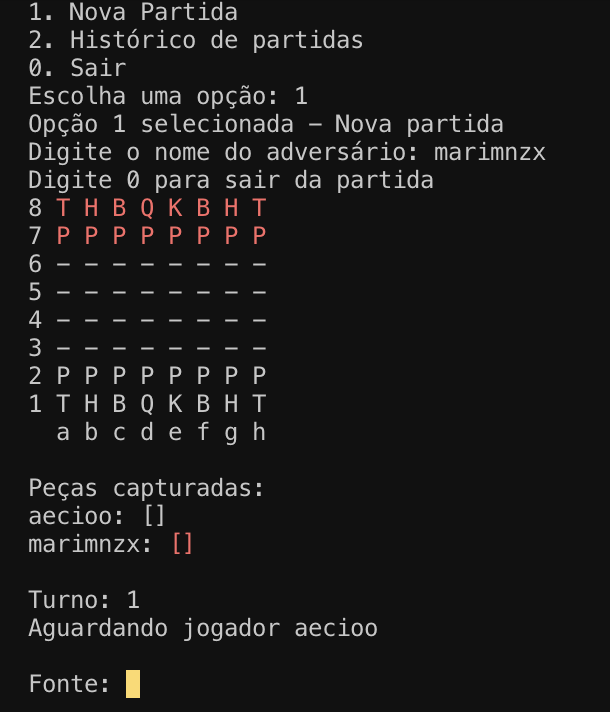

# [Projeto faculdade] Projeto do 2° período da faculdade - Jogo de xadrez em Java 
> **Cadeira:** Laboratório de programação 2  
> **Universidade:** UFRPE - Universidade Federal Rural de Pernambuco  
> **Alunos:** Aécio José
-----------------------------------------------------------------------------------------------------------
## Qual a ideia do projeto?
A ideia deste projeto é criar um jogo de xadrez desenvolvido em java, utilizando Maven como gerenciador de dependências e a biblioteca Jackson para manipulação de arquivos JSON. O jogo possui uma interface no terminal que permite aos usuários jogar partidas de xadrez e também mantém um histórico das partidas em um arquivo JSON.

Algumas imagens do projeto:  

## Como Rodar?
### Abaixo está o passo a passo de como instalar as bibliotecas e rodar a loja de roupas.

1- Rode o projeto no vscode no botão de "Run"  
2- Faça login com seu usuário criado, ou registre um usuário
